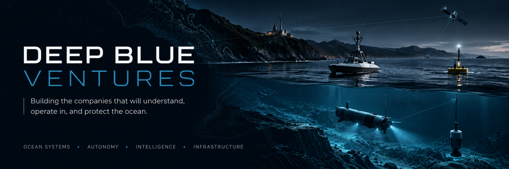
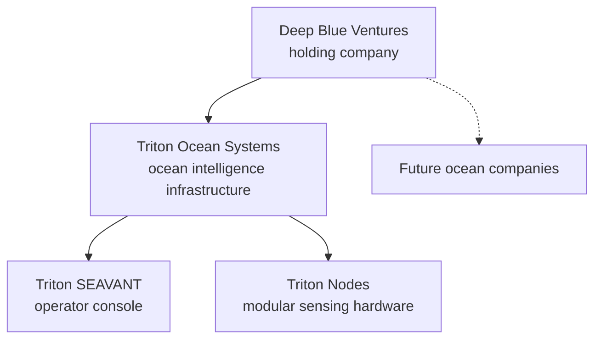

  

  <b>One parent company. A family of ocean companies. Shared foundations, independent missions.</b>

---

## About us

**Deep Blue Ventures** is the holding company for our ocean businesses. It owns, funds and builds companies that work on the ocean: how we observe it, understand it and operate in it.

Each company runs as its own business, with its own product, customers and GitHub organization. Deep Blue Ventures holds the ownership, sets the long-term direction and provides the foundations every company needs, so no company has to rebuild them from scratch.

We are based in South Florida.

## Our companies

| Company | What it does | Stage |
|---|---|---|
| [**Triton Ocean Systems**](https://github.com/Triton-Ocean-Systems) | The distributed intelligence layer for the ocean: modular Triton Nodes connected to the Triton SEAVANT operator console, starting with coastal deployments in Florida. | Building. Ocean Node 001, the reference prototype, is in development. |

New companies are added here as they are formed.

## How the group fits together

| Deep Blue Ventures provides | Each company owns |
|---|---|
| Ownership, capital and long-term direction | Its product, customers and revenue |
| Brand, legal and corporate structure | Its team, roadmap and day-to-day decisions |
| Shared engineering, security and data standards | Its code, in its own GitHub organization |

## How we build companies

Every company in the group follows the same rules:

- **A buyer before a build.** A company starts with a known customer, a real problem and a budget, not with a technology looking for a use.
- **Specialize the mission, standardize the infrastructure.** Companies reuse proven building blocks instead of rebuilding them.
- **Evidence before claims.** We say what is proven, what is tested and what is still a hypothesis, and we publish failures alongside their fixes.
- **Capital efficiency first.** We pay for reusable assets only when the reuse is real.
- **Slow on one-way doors, fast on two-way doors.** Ocean hardware has long correction times, so irreversible decisions get written assumptions first.

## Work with us

- **Customers and partners:** reach the right company through its page above.
- **Investors:** interested in the group and its companies.

Reach us at **tritonminingco@gmail.com**.

© Deep Blue Ventures. All rights reserved.
